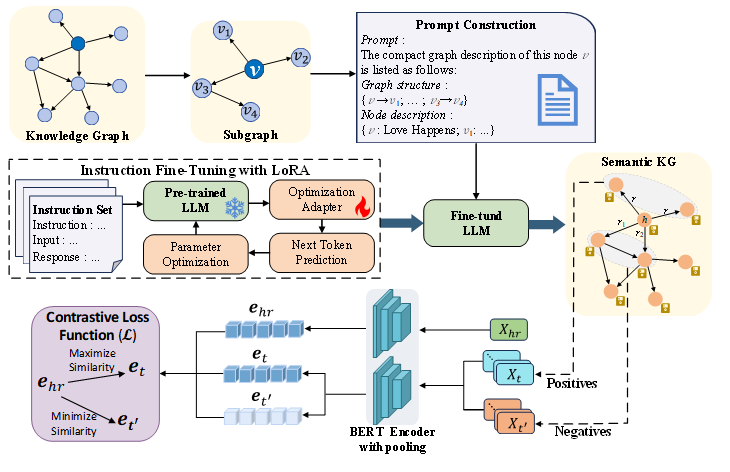

# SemKGC: Semantic Label Generation with LLMs for Knowledge Graph Completion



## Overview

This repository contains the implementation of the paper SemKGC: Semantic-Aware Knowledge Graph Completion with Fine-Grained Relation Semantics. In this work, we propose a semantic-enhanced KGC framework that leverages fine-grained relation semantic representations and optimized training paradigms, achieving consistent performance gains across standard benchmarks.

## Requirements

- Python 3.7 or above
- Additional dependencies are listed in `requirements.txt`


## Installation

1. Clone this repository

2. Install the required dependencies:

```sh
pip install -r requirements.txt
```

## Data preparation
All data processing is complete. The directory structure is illustrated below.

```
data
├── FB15k237
│   ├── entities.json
│   ├── inverse_relations.json
│   ├── test.json
│   ├── train.json
│   └── valid.json
├── WN18RR
│   ├── entities.json
│   ├── inverse_relations.json
│   ├── test.json
│   ├── train.json
│   └── valid.json
```

## Training and evaluation

The scripts to train and evaluate a model on the WN18RR and FB15k-237 datasets are available in the `scripts` folder.

## Running Commands

This document provides the exact training and evaluation commands for reproducing results on the WN18RR and FB15k-237 datasets. All hyperparameter settings are consistent with the configurations reported in the paper.

## WN18RR
Run the following command to train and evaluate on the WN18RR dataset:
```bash
python3 src/main.py \
  --dataset WN18RR \
  --pretrained_model /path/to/bert-base-uncased \
  --tau 0.03 \
  --max_num_tokens 150 \
  --additive_margin 0.02 \
  --epochs 65 \
  --batch_size 128 \
  --lr 8e-5 \
  --use_neighbor_names \
  --pooling mean \
  --workers 4 \
  --experiment_name wn18rr \
  --do_test \
  --neighbor_weight 0.05 \
  --rerank_n_hop 5 \
  --eval_batch_size 128

## FB15k-237
Run the following command to train and evaluate on the FB15k-237 dataset:
TOKENIZERS_PARALLELISM=true python src/main.py \
  --dataset FB15k237 \
  --pretrained_model /path/to/bert-base-uncased \
  --max_num_tokens 150 \
  --additive_margin 0.02 \
  --epochs 10 \
  --batch_size 128 \
  --tau 0.04 \
  --lr 1e-5 \
  --workers 4 \
  --use_neighbor_names \
  --pooling mean \
  --experiment_name FB15k237 \
  --do_test \
  --neighbor_weight 0.05 \
  --rerank_n_hop 2 \
  --eval_batch_size 128

All commands above are provided in the `run_commands.txt` file.

## Acknowledgements
The code is partially borrowed from [SimKGC](https://github.com/intfloat/SimKGC).

## Citation
If you find this work useful, please consider citing:

```

```
